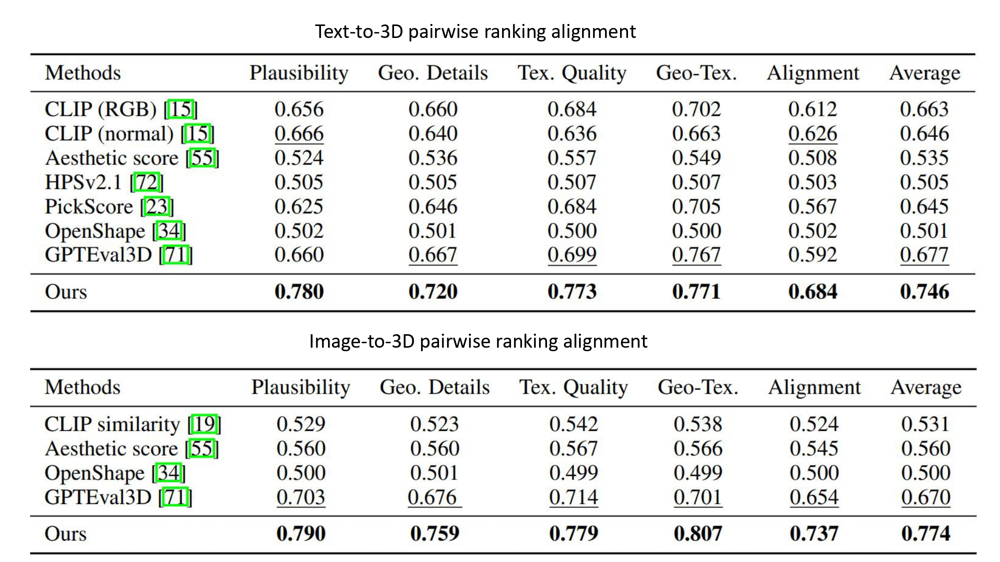

# 3DGen-Bench: Comprehensive Benchmark Suite for 3D Generative Models

### [Project page]() | [Paper]() | [Video]() | [Dataset](https://huggingface.co/datasets/3DGen/3DGen-Bench) | [Arena](https://huggingface.co/spaces/ZhangYuhan/3DGen-Arena)

In this work, we present **3DGen-Bench**, the first comprehensive human preference dataset for 3D models. For efficient data collection, we build the **3DGen-Arena**, a public voting platform in a pairwise battle manner. Then, we perform a comprehensive evaluation for numerous 3D generative models, and train an automatic scoring model **3DGen-Score**, which aligns well with human judgment.

## Dataset

- We build **3DGen-Arena**, a public benckmark platform for 3D generative models. You can contribute votes and find learderboard from [here](https://huggingface.co/spaces/ZhangYuhan/3DGen-Arena)
- We released full prompts, 3D assets and human annotations on Huggingface, you are free to download from [here](https://huggingface.co/datasets/3DGen/3DGen-Bench). 

## 3DGen-Score

We train **3DGen-Score** from our dataset, and achieve outstanding human coherance.

## Code are coming soon...