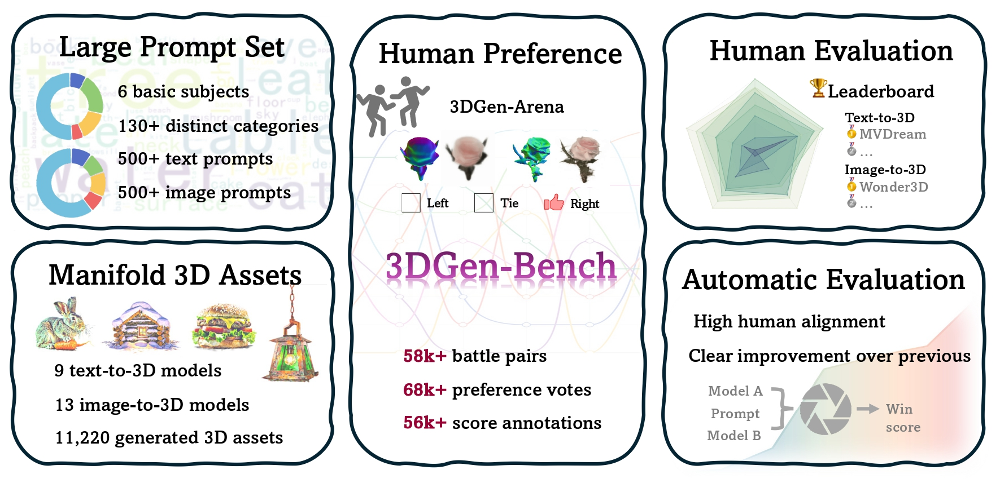

# 3DGen-Bench: Comprehensive Benchmark Suite for 3D Generative Models

### [Project page]() | [Paper]() | [Video]() | [Arena](https://huggingface.co/spaces/ZhangYuhan/3DGen-Arena) | [Data](https://huggingface.co/datasets/3DGen/3DGen-Bench)

In this work, we present **3DGen-Bench**, the first comprehensive human preference dataset for 3D models. For efficient data collection, we build the **3DGen-Arena**, a public voting platform in a pairwise battle manner. Then, we perform a comprehensive evaluation for numerous 3D generative models, and train an automatic scoring model **3DGen-Score**, which aligns well with human judgment.




## Data
- We carefully design 1,100 prompts(510 for text and 510 for image), select 19 generative models(9 for text-to-3D and 13 for image-to-3D), and obtain 11,220 3D assets finally.
- We build **3DGen-Arena**, a public benckmark platform for 3D generative models. You can contribute votes and find learderboard from [here](https://huggingface.co/spaces/ZhangYuhan/3DGen-Arena)
- We released full prompts, 3D assets and human annotations on Huggingface, you are free to download from [here](https://huggingface.co/datasets/3DGen/3DGen-Bench). 


## 3DGen-Score
We train **3DGen-Score** from our dataset, and achieve outstanding human coherence.

<!--  -->

### Install
```
    conda create -n 3dgen python==3.9
    conda activate 3dgen
    pip install -r requirements.txt
```

### Inference
make `./checkpoint` dir and download our pretrained weights from [here](https://huggingface.co/3DGen/3dgen-score-mvclip-v1)
```
python demo.py
```

### Train
- **Step1** make `./data` dir and download preference data from [here](https://huggingface.co/datasets/3DGen/3DGen-Bench).
    - `data/gallery`: unzip `images_prompts.zip` and move into `data/gallery/rgba`
    - `data/preference_annotation`: human preference data in `json` format, splited into ["train", "valid", "test"]
    - `data/surrounding_views`: 4-view concated images of 3D assets
    - `data/objects`: `.ply` files of 3D assets(Unused here)
- **Step2** "two-stage" training strategy 
    - *Stage1 Contrastive Loss* 
    ```
        accelerate launch --dynamo_backend no --gpu_ids all --num_processes 1  --num_machines 1 --use_deepspeed trainer/scripts/train.py +experiment=clip_h_neg
    ```
    - *Stage2 Evaluation Loss* 
    ```
        accelerate launch --dynamo_backend no --gpu_ids all --num_processes 1  --num_machines 1 --use_deepspeed trainer/scripts/train.py +experiment=clip_h_2
    ```